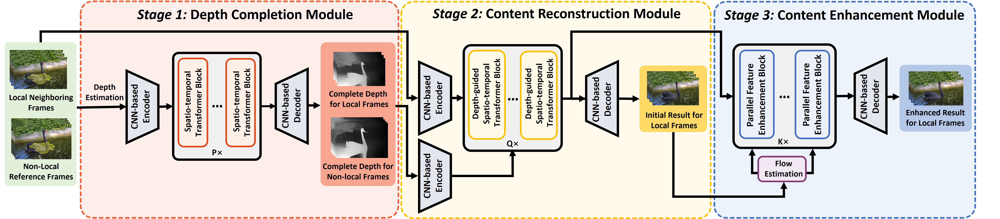

# Depth-guided Deep Video Inpainting

By Shibo Li, [Shuyuan Zhu](https://ieeexplore-dev.ieee.org/author/37407520000), Yao Ge, [Bing Zeng](https://ieeexplore.ieee.org/author/37270871000), [Muhammad Ali Imran](https://www.gla.ac.uk/schools/engineering/staff/muhammadimran/), [Qammer H. Abbasi](https://www.gla.ac.uk/schools/engineering/staff/qammerabbasi/), [Jonathan Cooper](https://www.gla.ac.uk/schools/engineering/staff/jonathancooper/#biography).

This repo is the official Pytorch implementation of [Depth-guided Deep Video Inpainting](https://ieeexplore.ieee.org/document/10345745), which is published by IEEE Transactions on Multimedia (TMM).

## Introduction


## Usage

### Prerequisites
- Python >= 3.6
- Pytorch >= 1.0 and corresponding torchvision (https://pytorch.org/)

### Install
- Clone this repo:
```
git clone https://github.com/lishibo888/DGDVI.git
```
- Install other packages:
```
cd DGDVI
pip install -r requirements.txt
```

### Dataset preparation
Download datasets ([YouTube-VOS](https://competitions.codalab.org/competitions/20127) and [DAVIS](https://davischallenge.org/davis2017/code.html)) into the data folder.

```
mkdir data
```
Note: We use [YouTube Video Object Segmentation dataset **2019** version](https://youtube-vos.org/dataset/).

## Test
Download [pre-trained model](https://drive.google.com/drive/folders/13SBQeUJfsm4haF8JMKapLrriH0bKT1lQ?usp=share_link) into checkpoints folder.
```
mkdir checkpoints
```

### Test script
For video completion task:
```
python test.py -video_path data/DAVIS/JPEGImages/480p/surf -mask_path data/dataset_masks/davis/test_masks/surf
```

For object removal task:
```
python test.py -video_path data/DAVIS/JPEGImages/480p/surf -mask_path data/DAVIS/Annotations/480p/surf
```

## Evaluation
You can follow [free-form mask generation scheme](https://github.com/JiahuiYu/generative_inpainting) for synthesizing random masks.

Or just download [our prepared stationary masks](https://drive.google.com/file/d/1dFTneS_zaJAHjglxU10gYzr1-xALgHa4/view) and unzip it to data folder. 

Then you need to download [pre-trained model](https://drive.google.com/file/d/1A-ilDsXZCVhWh2_erApyL7C0jXhaeTjR/view?usp=sharing) for evaluating [VFID](https://github.com/deepmind/kinetics-i3d). 
```
mv i3d_rgb_imagenet.pt checkpoints/
```

### Evaluation script
To conduct an evaluation on the DAVIS dataset, please execute the command:
```
python evaluate.py  --dataset davis
```

To conduct an evaluation on the YouTube-VOS dataset, please execute the command:
```
python evaluate.py --model fuseformer --ckpt checkpoints/fuseformer.pth --dataset youtubevos --width 432 --height 240
```

For evaluating warping error, please refer to https://github.com/phoenix104104/fast_blind_video_consistency

## Citing DGDVI
If you find DGDVI useful in your research, please consider citing this early access version:
```
@ARTICLE{10345745,
  author={Li, Shibo and Zhu, Shuyuan and Ge, Yao and Zeng, Bing and Imran, Muhammad Ali and Abbasi, Qammer H. and Cooper, Jonathan},
  journal={IEEE Transactions on Multimedia}, 
  title={Depth-guided Deep Video Inpainting}, 
  year={2023},
  volume={},
  number={},
  pages={1-12},
  doi={10.1109/TMM.2023.3340089}}
```

## Acknowledement
This project is based on [STTN](https://github.com/researchmm/STTN) and [FuseFormer](https://github.com/ruiliu-ai/FuseFormer). 


